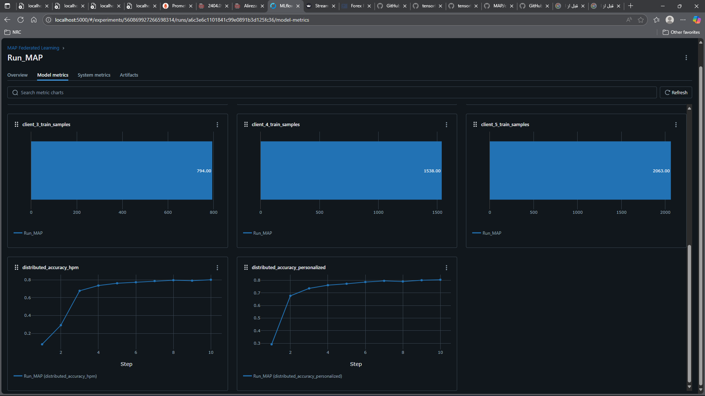
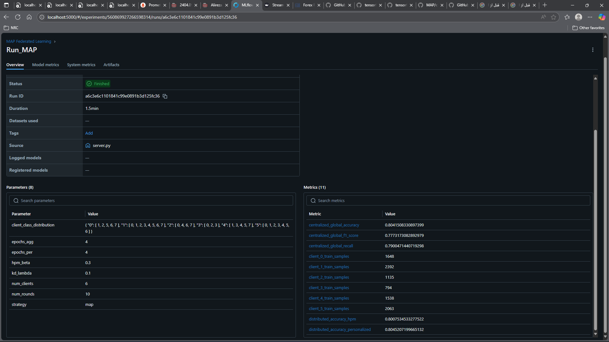
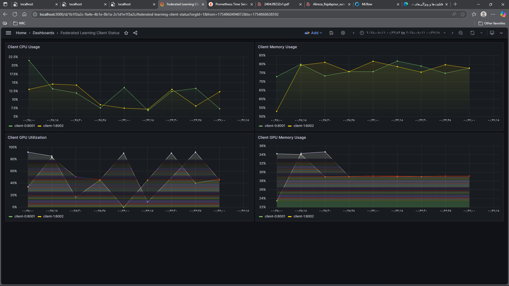
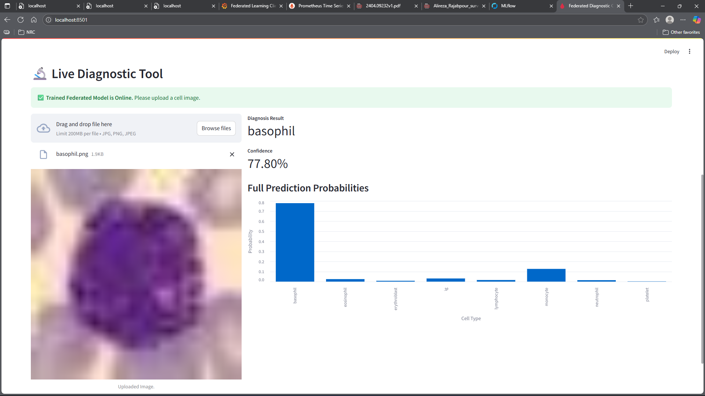
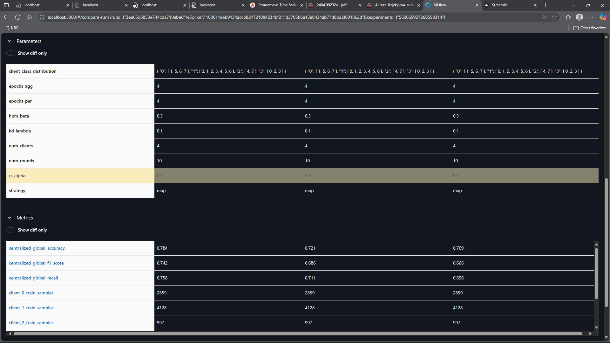
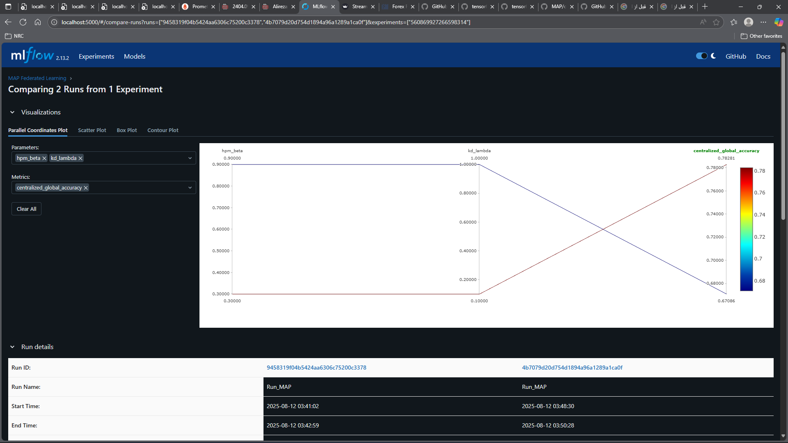
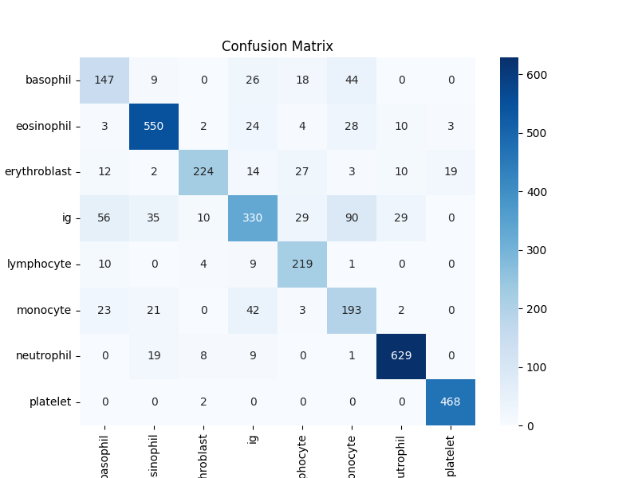
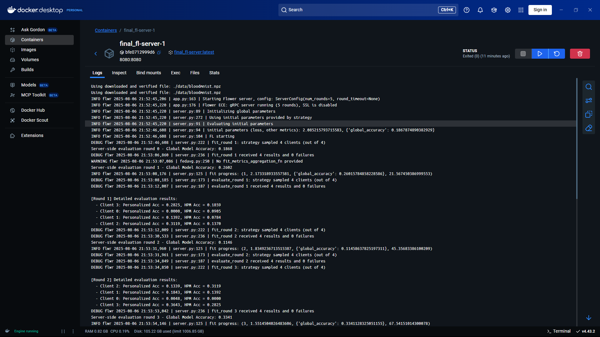

# Federated Learning Blood Cell Diagnostic System

A distributed federated learning system for blood cell classification using PyTorch and Flower, designed to address Non-IID and missing-class challenges in medical datasets through the MAP (Model Aggregation and Personalization) strategy.

---

## Overview

This project implements an end-to-end federated learning environment for blood cell image classification using the BloodMNIST dataset.

The system simulates multiple medical centers participating in collaborative model training without sharing raw data. It focuses on solving one of the major federated learning challenges:

- Non-IID data distribution
- Missing-class scenarios
- Personalized client optimization
- Stable global aggregation

The project combines:

- Federated Learning
- Computer Vision
- Deep Learning
- MLOps
- Distributed Systems
- Monitoring & Observability
- Containerized Infrastructure

---

## Key Features

- Federated learning simulation using Flower
- MAP (Model Aggregation and Personalization) strategy implementation
- Personalized client models using HPM
- Restricted Softmax (RS) aggregation stabilization
- Non-IID missing-class data simulation
- PyTorch-based CNN training pipeline
- MLflow experiment tracking
- Prometheus + Grafana monitoring stack
- Dockerized multi-service architecture
- Streamlit inference UI
- Distributed client/server orchestration

---

## System Architecture

```text
                    +----------------------+
                    |   MLflow Tracking    |
                    +----------+-----------+
                               |
                               |
+------------+        +--------v--------+        +-------------+
| FL Client  |------->|  Flower Server  |<-------| FL Client   |
| Hospital A |        |  MAP Strategy   |        | Hospital B  |
+------------+        +--------+--------+        +-------------+
                               |
                               |
                    +----------v-----------+
                    | Prometheus + Grafana |
                    +----------+-----------+
                               |
                               |
                    +----------v-----------+
                    |   Streamlit UI       |
                    +----------------------+
```

---

## Federated Learning Workflow

1. The central Flower server initializes the global model.
2. Clients receive the global model parameters.
3. Each client performs local training on private BloodMNIST subsets.
4. Restricted Softmax (RS) is applied during aggregation-focused training.
5. Personalized training is performed using HPM-based knowledge distillation.
6. Clients send updated weights to the server.
7. The server aggregates updates using the MAP strategy.
8. MLflow logs metrics and experiments.
9. Prometheus and Grafana monitor system resources in real time.

---

## MAP Strategy

This project implements the MAP (Model Aggregation and Personalization) strategy to address missing-class federated learning scenarios.

### Restricted Softmax (RS)

Restricted Softmax prevents harmful gradient updates from classes unavailable in local client datasets.

Benefits:
- More stable aggregation
- Better global model convergence
- Reduced class bias

Hyperparameter:
- rs_alpha

### Hyper-Personalized Model (HPM)

Each client maintains a personalized historical model.

Benefits:
- Faster personalization
- Improved local accuracy
- Reduced post-aggregation performance drop

Knowledge distillation is used between:
- Teacher model: HPM
- Student model: Current local model

Hyperparameters:
- hpm_beta
- kd_lambda

---

## Tech Stack

### Machine Learning
- PyTorch
- Flower
- Scikit-learn

### MLOps & Monitoring
- MLflow
- Prometheus
- Grafana

### Infrastructure
- Docker
- Docker Compose

### Backend & Utilities
- Python
- NumPy
- Pandas

### UI
- Streamlit

---

## Dataset

Dataset used:
- BloodMNIST

The dataset contains 8 blood cell classes for medical image classification tasks.

Reference:
https://medmnist.com/

---

## Project Structure

```text
.
├── client.py
├── server.py
├── strategy.py
├── model.py
├── app.py
├── docker-compose.yml
├── requirements.txt
├── prometheus.yml
├── grafana/
├── screenshots/
└── README.md
```

---

## Installation

### Clone Repository

```bash
git clone https://github.com/alirezarajabpour/Federated-Learning-blood-cell-diagnostic.git

cd Federated-Learning-blood-cell-diagnostic
```

---

## Environment Setup

### Using Virtual Environment

```bash
python -m venv venv

source venv/bin/activate
```

Install dependencies:

```bash
pip install -r requirements.txt
```

---

## Running the System

### Run Entire Federated Environment

```bash
docker compose up --build
```

This launches:

- Flower server
- Federated clients
- MLflow
- Prometheus
- Grafana
- Streamlit UI

---

## Access Services

| Service | URL |
|---|---|
| MLflow | http://localhost:5000 |
| Grafana | http://localhost:3000 |
| Prometheus | http://localhost:9090 |
| Streamlit UI | http://localhost:8501 |

---

## Monitoring & Experiment Tracking

### MLflow

MLflow is used for:
- Experiment tracking
- Hyperparameter logging
- Metric visualization
- Artifact storage

Tracked metrics include:
- Global accuracy
- Personalized accuracy
- F1-score
- Confusion matrix

### Grafana + Prometheus

Real-time monitoring includes:
- CPU usage
- Memory usage
- GPU utilization
- Client resource consumption

---

## Results

The MAP strategy demonstrated significant improvements compared to standard FedAvg in Non-IID missing-class environments.

### Key Observations

- Improved global accuracy
- Better personalized performance
- Faster convergence
- More stable aggregation
- Reduced post-aggregation performance degradation

---

## Screenshots

### MLflow Experiment Tracking




---

### Grafana Monitoring Dashboard



---

### Streamlit Inference UI



---

### Federated Training Results (Hyperparameters Comprision)




---

### 6 Clients Confusion Matrix



---

### Client & Server Logs




---

## Challenges

### Non-IID Data Distribution

Clients contain incomplete class distributions which destabilize aggregation.

### Missing-Class Problem

Some clients completely lack specific blood cell classes.

### Personalized Learning

Balancing global aggregation and local specialization was one of the main challenges.

### Distributed Monitoring

Building reproducible monitoring and orchestration pipelines inside Dockerized environments required careful infrastructure design.

---

## License

This project is licensed under the MIT License.

---

## Acknowledgments

This project was inspired by research on personalized federated learning and missing-class federated optimization strategies.

Frameworks and tools used:
- Flower
- PyTorch
- MLflow
- Grafana
- Prometheus
- Streamlit
- Docker

---

## Author

Alireza Rajabpour

GitHub:
https://github.com/alirezarajabpour
